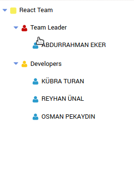

# react-tree-schema
Tree component for React.js apps.


# Install

```javascript

npm install react-tree-schema

```
# Architecture


# Components

## Root Component

```javascript
import React from 'react'
import Root from 'react-tree-schema'

const Tree = () => (
  <Root childNodes={[
    { 
      name: 'React Team',
      opened: true ,
      childNodes: [
        { 
          name: 'Team Leader', 
          childNodes: [
            { name: 'Abdurrahman EKER' },
          ]
        },
        {
          name: 'Developers', 
          childNodes: [
            { name: 'Kübra TURAN' },
            { name: 'Reyhan ÜNAL' },
            { name: 'Osman PEKAYDIN' },
          ]
        },
      ]
    }
  ]}/>
)
```
#### Root props
| prop | default | type | description |
| ---- | ---- | ---- | ---- |
| name | none | string | Node title |
| childNodes | none | array | Node items |
| opened | false | boolean | visible nodes of the noden  |
| icon | none | object | icon of node |
| onClick | none | function | Node on click |
| onContextMenu | none | function | Node on context menu |


### Child Node Item
| prop | default | type | description |
| ---- | ---- | ---- | ---- |
| name | none | string | Node title |
| childNodes | none | array | Node items |
| opened | false | boolean | visible nodes of the noden  |
| icon | none | object | icon of node |
| onClick | none | function | Node on click |
| onContextMenu | none | function | Node on context menu |
